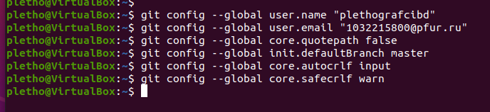
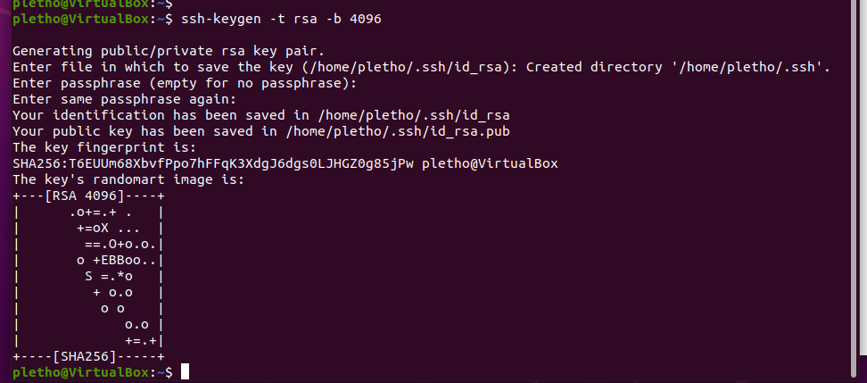
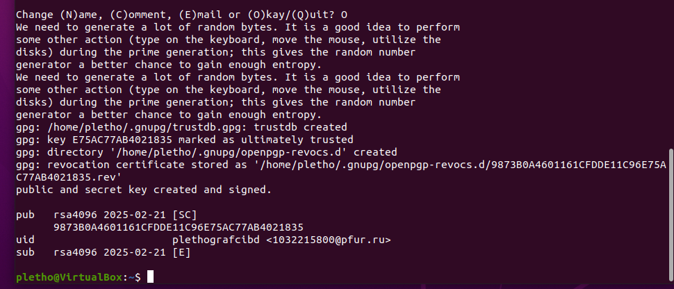
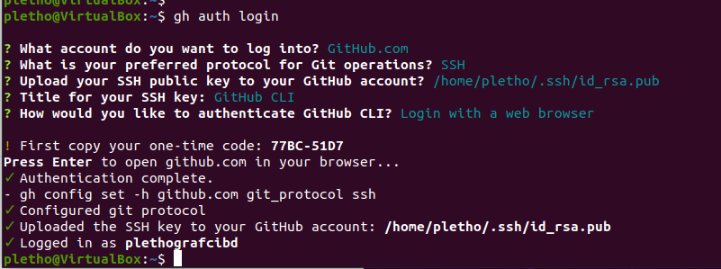
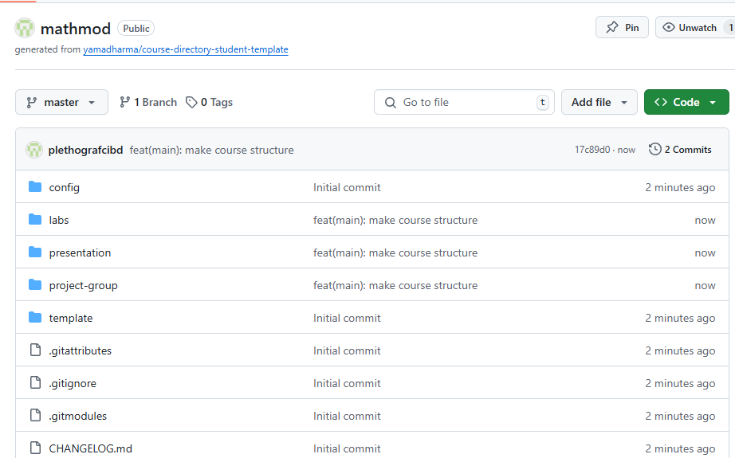

---
## Front matter
lang: ru-RU
title: Математическое моделирование
subtitle: Лабораторная работа 1. Система контроля версий Git.
author:
  - Плето Плето Мбамби
institute:
  - Российский университет дружбы народов, Москва, Россия
date: 21.02.2025

## i18n babel
babel-lang: russian
babel-otherlangs: english

## Formatting pdf
toc: false
toc-title: Содержание
slide_level: 2
aspectratio: 169
section-titles: true
theme: metropolis
header-includes:
 - \metroset{progressbar=frametitle,sectionpage=progressbar,numbering=fraction}
---

# Цели и задачи работы

## Цель лабораторной работы

Целью данной работы является изучение идеологии и применения средств контроля версий.

## Задачи лабораторной работы

1. Создать учетную запись на github.com

2. Настроить репозиторий

# Процесс выполнения лабораторной работы

## Системы контроля версий

Git — это система контроля версий (VCS), которая позволяет отслеживать и фиксировать изменения в коде: 
вы можете восстановить код в случае сбоя или откатить до более ранних версий.

Команды Git принимают вид git <команда> <аргументы>, где аргументом может быть путь к файлу. 

## Подготовительные параметры

{ #fig:001 width=70% height=70% }

## Генерируем SSH-ключ

{ #fig:002 width=70% height=70% }

## Генерируем GPG-ключ

{ #fig:003 width=70% height=70% }

## Авторизуемся в github при помощи утилиты gh

{ #fig:004 width=70% height=70% }

## Оформленный репозиторий.

{ #fig:005 width=70% height=70% }

# Выводы по проделанной работе

## Вывод

Мы приобрели практические навыки работы с системой контроля версий git и создали свой репозиторий.

